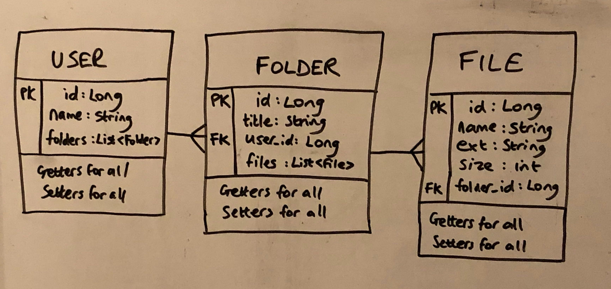
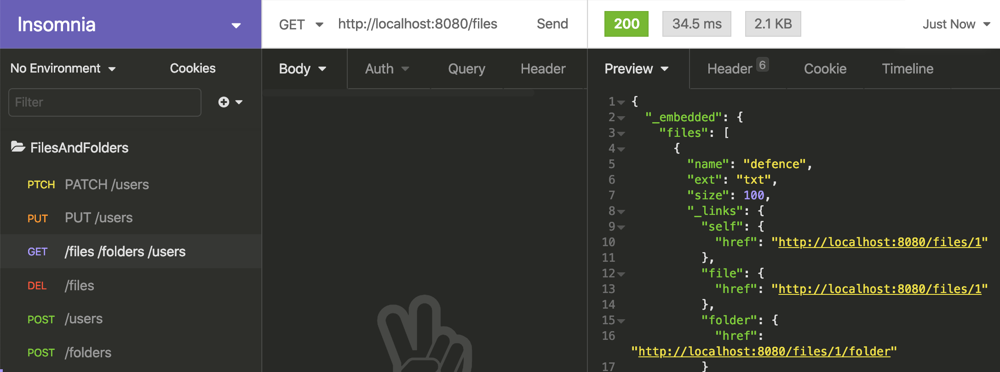
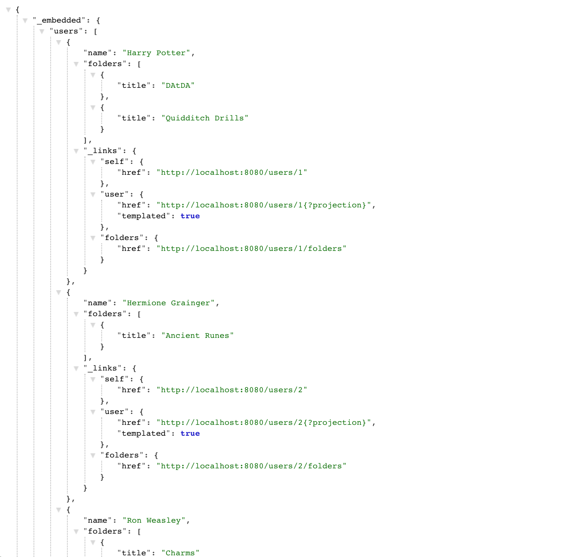
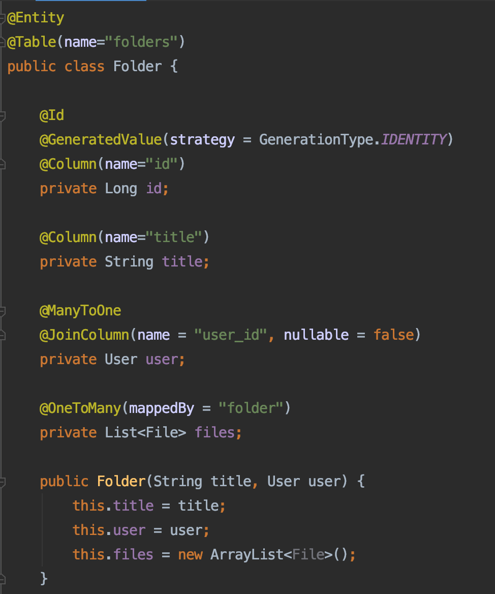

# Configuring a RESTful API using Spring and Spring Data REST

This was an evening homework to practice using Spring and Spring Data REST to create a number of annotated classes that persist to the postgreSQL database and that can be accessed via a RESTful API.
The brief was to create a One-To-Many Spring Application with the following models: Folders, Files and Users. Users should have many folders, and folders should have many files.

Class diagram I sketched out to process the brief and understand structure before setting up the files:

Testing RESTful Routes in Insomnia to Get, Post, Put, Patch and Delete:

API in the browser, displaying at localhost/users:

Code from Folder.java file, setting up class and annotations:
